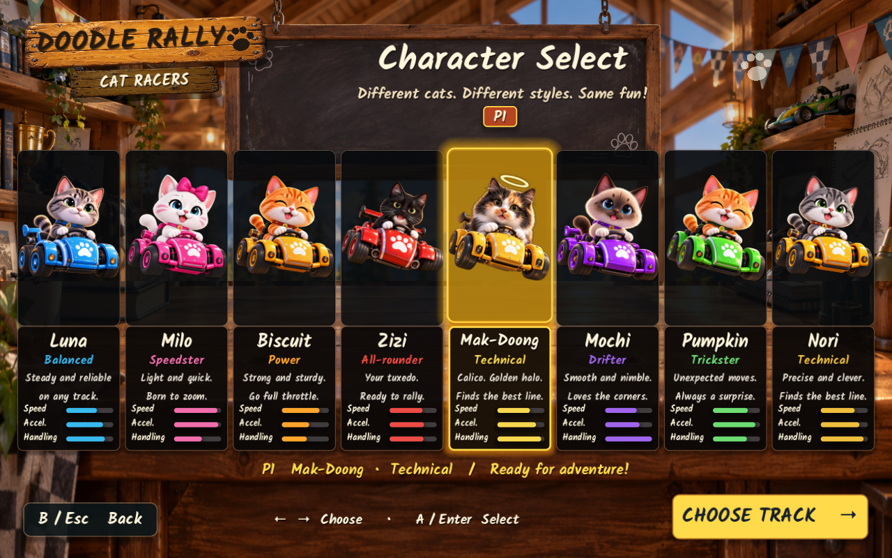
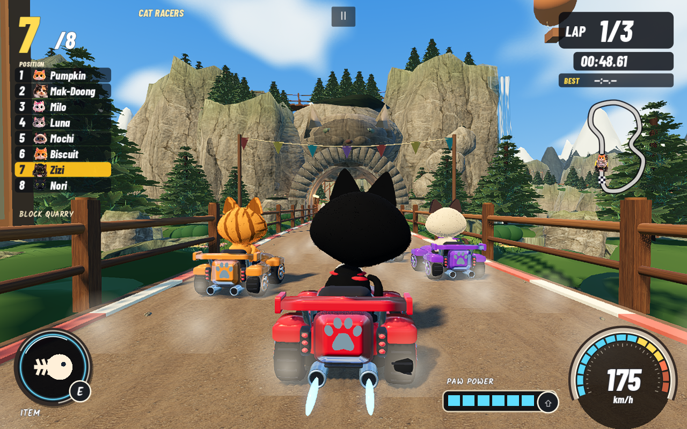
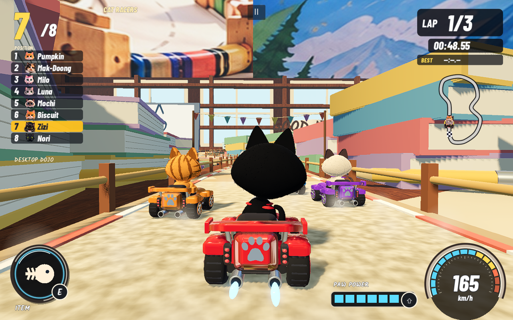
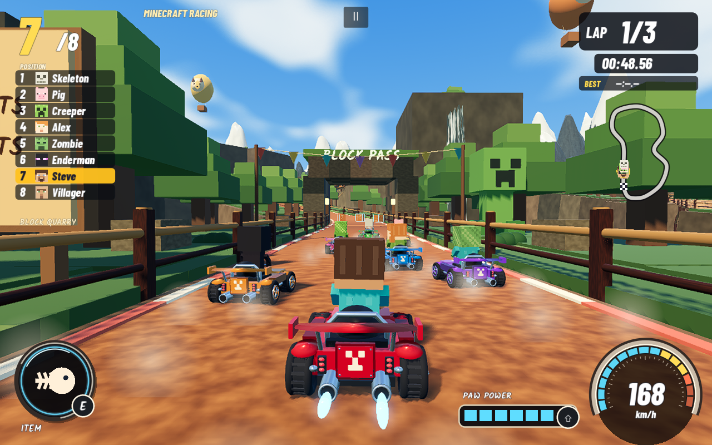

# Doodle Rally — Cat Racers

**Doodle Rally** is a standalone single player 3D kart racer for macOS. Pick a cat, choose a course, and race seven rivals through a paper craft studio, an alpine quarry, or a neon block world. The game keeps the playful hand painted feel of the supplied Cat Racers references while using a real time 3D chase camera, physics based kart contact, items, drifting, boosts, and a second Minecraft Racing roster.

The current source and Universal Mac build are version **1.3.2**. The original Doodle Rumble project is separate and is not modified.

## Screenshots

The visual review gallery is in [docs/SCREENSHOTS.md](docs/SCREENSHOTS.md). These captures come from the native QA build at 1280×800.

<table>
  <tr>
    <td></td>
    <td></td>
    <td></td>
  </tr>
  <tr>
    <td></td>
    <td></td>
    <td></td>
  </tr>
</table>

## Play the Mac build

Unzip **Doodle_Rally_1.3.2_Mac.zip** and open **Doodle Rally 1.3.2.app**, or open the app inside `builds/Doodle Rally 1.3.2.app`. Godot is not required to play. The bundle contains Apple Silicon and Intel executables. It is signed locally and is not Apple notarized, so macOS may ask you to choose **Open Anyway** in **System Settings → Privacy & Security** when the ZIP came from another Mac.

Choose **Start Game** for the cat roster or **Minecraft Racing** for the block characters. Pick a racer and a track, select **Easy**, **Medium**, or **Hard** beneath the track cards, then select **LET'S RACE!** Up/down also changes difficulty on that screen. Easy keeps the previous default rival pace; Medium and Hard raise the competition. The BenJam Games logo appears briefly when the app launches and can be skipped with any key, click, or controller button.

## What is in the game

- Eight distinct cats: **Zizi** (the tuxedo hero with a white chin, chest, and paws), Luna, Milo, Biscuit, **Mochi**, Pumpkin, **Mak-Doong** (the calico with a golden halo), and Nori. Zizi and Mak-Doong sit together in the middle of Character Select. Their names, colors, patterns, portraits, rear views, Garage previews, standings, and results stay consistent.
- Eight Minecraft style drivers: Steve, Alex, Creeper, Enderman, Zombie, Skeleton, Pig, and Villager. Their block geometry and pixel faces are original procedural game assets.
- Three courses: **Desktop Dojo**, **Block Quarry**, and **Glitch Core**. Each has its own surface, scenery, lighting, panorama, props, and soundtrack. Minecraft Racing swaps in block scenery and drivers on every course.
- Three lap races with seven AI rivals, selectable **Easy**, **Medium**, and **Hard** rival pacing, acceleration, braking, steering, drift hops, charged mini turbos, refillable boost, track boost pads, item boxes, barriers, minimap, speedometer, results, restart, and a Garage preview.
- On Cat Racers Track Select, the illustrated rear lineup gently sways its visible tails and leans its heads toward the highlighted course. Reduced Motion stops the idle tail movement.
- Items include a fish projectile, a yarn trap, catnip turbo, and a protective bubble. The game saves preferences and personal bests by course, difficulty, and roster.
- A longer evolving soundtrack uses three arrangements with crossfaded loop boundaries so the music does not stop or restart abruptly.
- **Smooth motion** is the default graphics mode. It keeps the interface at full resolution while scaling the 3D race scene, reducing shadow work and grouping nearby scenery for culling. **Balanced** and **Full detail** are available in Options if you prefer a sharper scene over frame rate.

## Controls

| Action | Keyboard | Controller |
| --- | --- | --- |
| Accelerate | W / ↑ | Right trigger |
| Brake | S / ↓ | Left trigger |
| Steer | A D / ← → | Left stick / D-pad |
| Hop and drift | Hold Space while steering | Hold LB / L1 while steering |
| Release drift for mini turbo | Release Space after charge | Release LB / L1 |
| Spend boost reserve | Shift | RB / R1 |
| Use item | E | X / Square |
| Recover to road center | R | Y / Triangle |
| Look behind | Hold C | Right stick click |
| Pause / resume | Esc | Start / Options |
| Fullscreen | F11 (or Fn–F11) | — |
| Select / back | Enter / Esc | A / B (Cross / Circle) |

## Technology

| Layer | Stack |
| --- | --- |
| Engine | Godot **4.7.2**, GDScript, Forward+ renderer |
| Platform | macOS Universal build: Apple Silicon + Intel, Metal graphics driver |
| 3D | Procedural meshes with `SurfaceTool`, spatially grouped `MultiMeshInstance3D`, `ShaderMaterial`, `PanoramaSkyMaterial`, custom fur and water shaders; FSR 1 spatial upscaling |
| Game systems | Fixed 60 Hz simulation, interpolated render transforms, collision aware AI, deterministic course sampling, saved preferences |
| Interface | Godot `Control`, `CanvasLayer`, `TextureRect`, `Label3D`, custom Kalam and Barlow fonts |
| Audio | Godot audio buses and generated WAV arrangements; no external audio plugin |
| Verification | Godot headless QA, Python 3 test/export helpers, native Mac smoke captures |
| Distribution | Godot macOS export preset, locally signed `.app`, ZIP package |

No add ons, game account, network service, or .NET runtime is needed to run the game. The visual assets combine procedural geometry, supplied reference renderings, supplied asset sheets, and generated transparent presentation sprites. Source and license notes are in [docs/ASSET_PROVENANCE.md](docs/ASSET_PROVENANCE.md).

## Build from source

Use standard Godot **4.7.2** with matching macOS export templates. Open `game/project.godot` and press F6/F5, or run the supplied checks:

```sh
python3 tools/test.py --godot /path/to/Godot.app/Contents/MacOS/Godot
python3 tools/export_mac.py --godot /path/to/Godot.app/Contents/MacOS/Godot --template /path/to/macos.zip
python3 tools/test_release.py
```

`tools/test.py` runs simulation, menu, roster, integration, world, audio, and collision checks. `game/tests/benchmark_difficulty.gd` replays all three difficulty levels on each course. `tools/test_release.py` launches the packaged app through the title, character, track, Garage, race, drive, and results screens and records fresh screenshots. The current verification record is [BUILD_STATUS.md](BUILD_STATUS.md), with release notes in [docs/releases/1.3.2.md](docs/releases/1.3.2.md).

Preferences are stored in Godot's separate **Doodle Rally Cat Racers** application data folder as `rally_3d.cfg`. The app does not read or change the original game's settings. Generated app bundles and temporary telemetry are excluded from the source repository.
