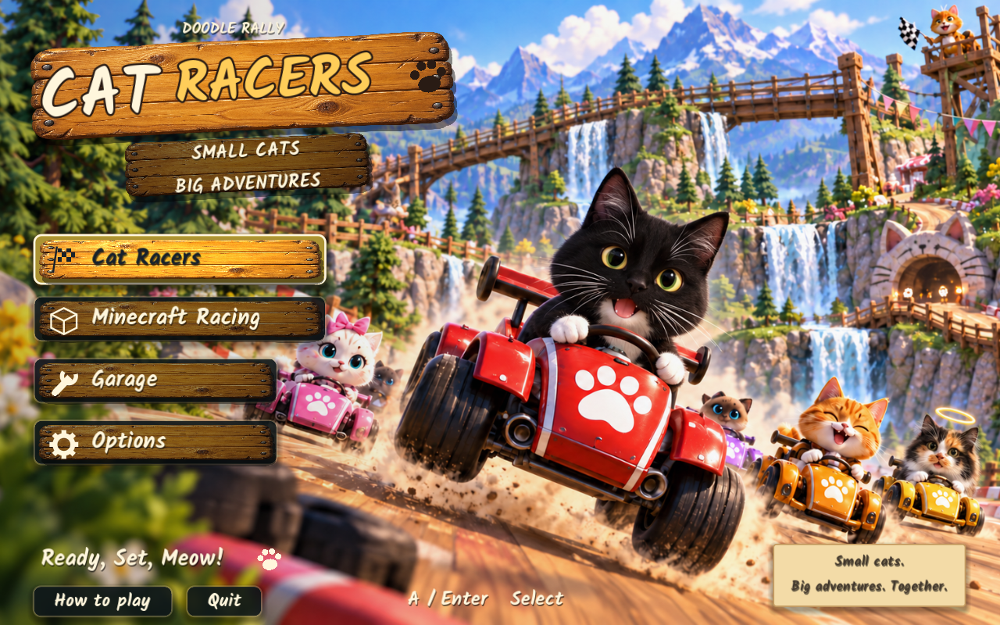
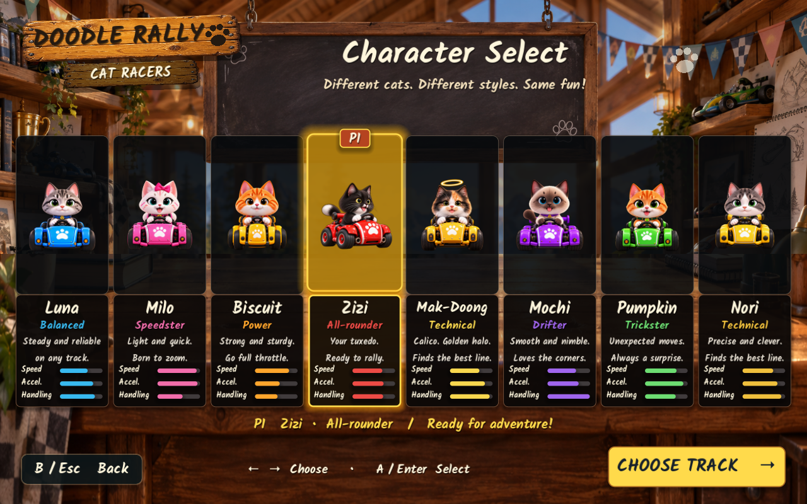
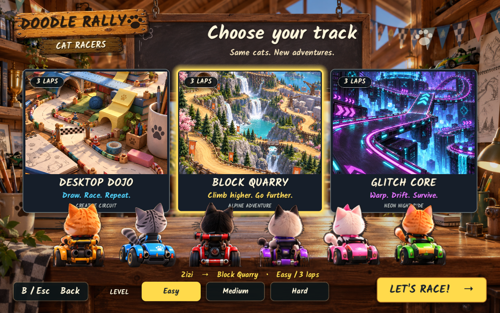
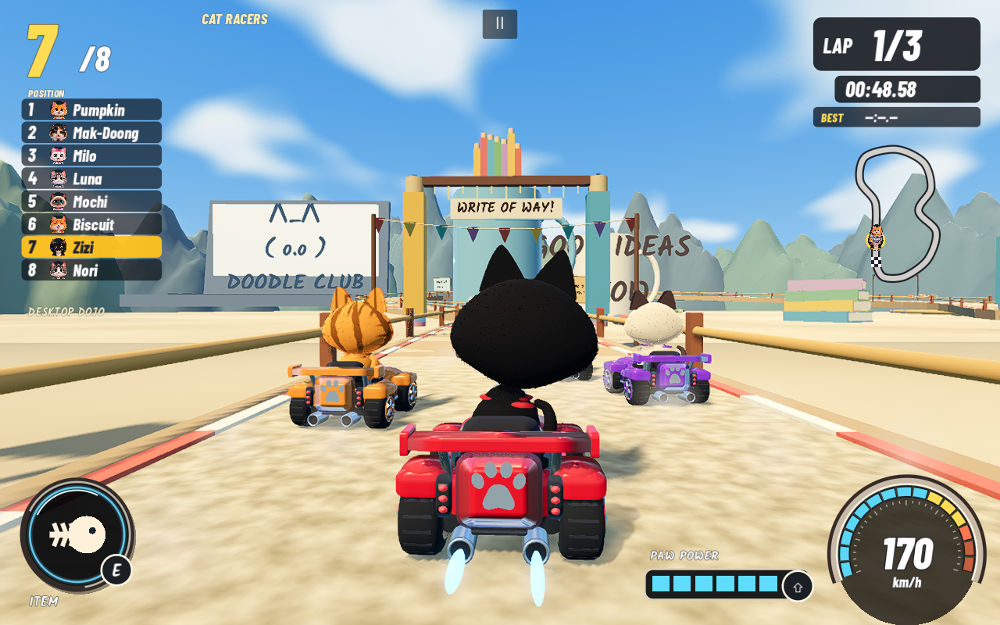
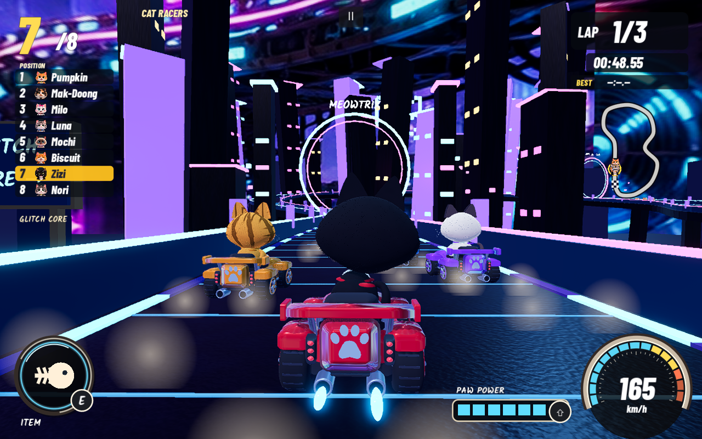
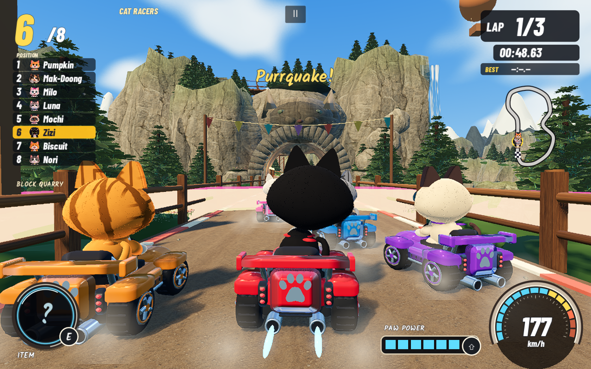
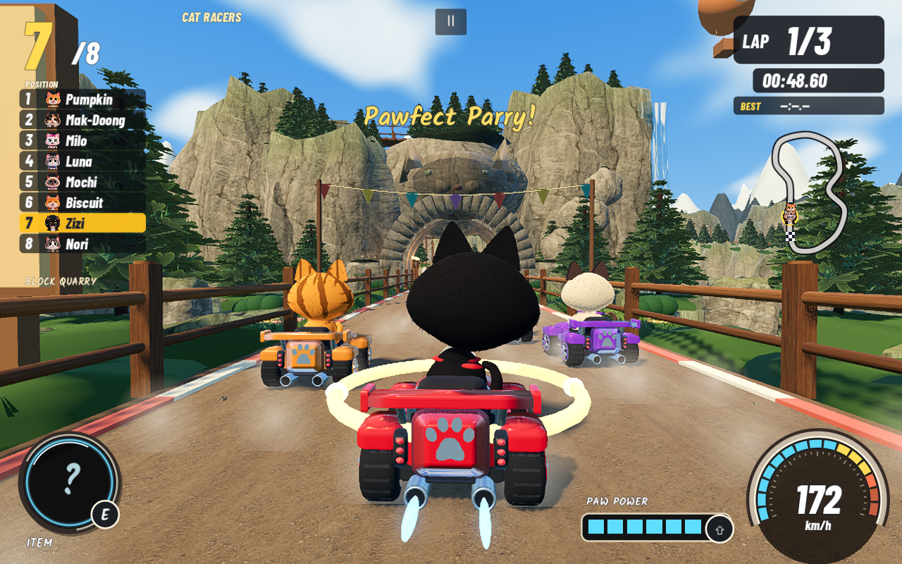
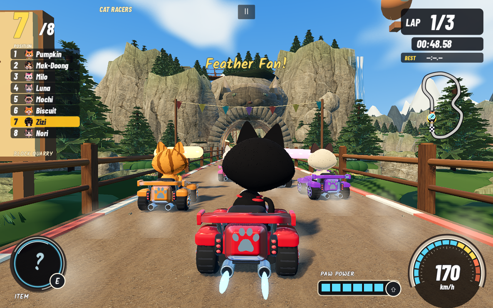
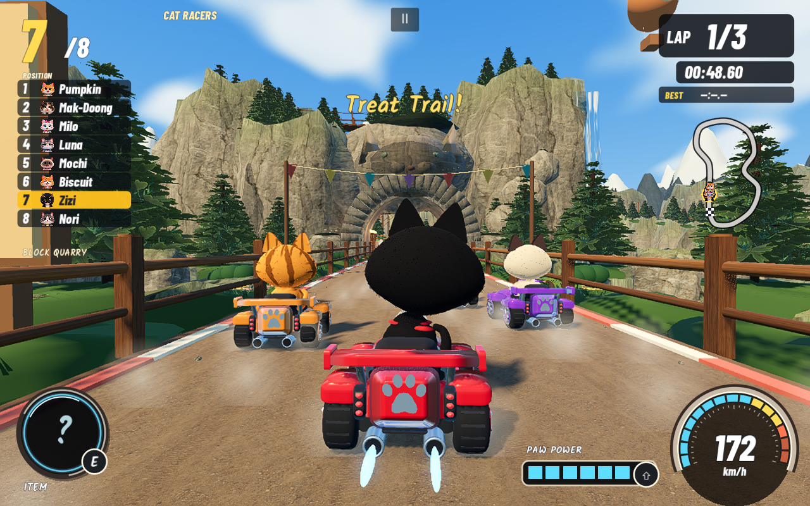

# Doodle Rally — Cat Racers

**Doodle Rally** is a standalone single player 3D kart racer for macOS. Pick a cat, choose a course, and race seven rivals through a paper craft studio, an alpine quarry, or a neon block world. The game keeps the playful hand painted feel of the supplied Cat Racers references while using a real time 3D chase camera, physics based kart contact, items, drifting, boosts, and a second Minecraft Racing roster.

The current source and Universal Mac build are version **1.4.0**. The original Doodle Rumble project is separate and is not modified.

## Screenshots

The visual review gallery is in [docs/SCREENSHOTS.md](docs/SCREENSHOTS.md). These captures come from the native QA build at 1280×800.

<table>
  <tr>
    <td></td>
    <td></td>
    <td></td>
  </tr>
  <tr>
    <td></td>
    <td></td>
    <td></td>
  </tr>
  <tr>
    <td></td>
    <td></td>
    <td></td>
  </tr>
  <tr>
    <td></td>
  </tr>
</table>

## How the game has grown

| Milestone | What changed |
| --- | --- |
| **1.1 · First playable Mac build** | Established the single-player kart-racing loop, three distinct course themes, rivals, items, and a native macOS app. |
| **1.2–1.3.0 · Character identity** | Refined the roster around photo-guided Zizi and Mak-Doong, carried their markings through selection, Garage, racing, standings, and results, and expanded the illustrated presentation. |
| **1.3.1–1.3.2 · Feel and competition** | Added Smooth Motion and graphics choices, interpolated rendering and scenery culling, then introduced Easy / Medium / Hard rivals and a living course-selection lineup. |
| **1.3.3 · Eight-cat art pack** | Integrated individual transparent sprites, portraits, animation frames, and separate effects for all eight cats while keeping the race renderer and controls intact. |
| **1.3.4–1.3.5 · Preview experiments** | Tested the selected-racer turntable presentation and refined its supplied artwork and selection layout. |
| **1.3.6 · High-resolution turntable** | Replaced the compressed rotating cutout with 16 supplied 1024×1024 views per cat, swapped one frame at a time over six seconds, and fixed Desktop Dojo's paper/deck depth overlap. |
| **1.3.7 · World and racer polish** | Improved rear-facing fur identity and racer shading. Desktop Dojo now has a quieter mountain horizon, hand-made pencil-pit landmarks, and playful ruler gates; Glitch Core keeps its neon city panorama. |
| **1.3.8 · A simpler start** | Removed duplicate Character Select and Track Select shortcuts from the title menu. Choose Cat Racers or Minecraft Racing first, then pick a racer and course in that mode's flow. |
| **1.4.0 · A clearer start, smarter items** | Put Cat Racers and Minecraft Racing first, followed by Garage and Options. Added Purrquake, the forward-spreading Feather Fan, Treat Trail's AI-baiting sniff trap, and the timing-based Pawfect Parry for more tactical choices and counterplay. |

Each release keeps earlier screenshots and verification evidence in the versioned folders under [`screenshots/`](screenshots/) and [`docs/test-results/`](docs/test-results/). The current build record is [BUILD_STATUS.md](BUILD_STATUS.md); release notes are in [`docs/releases/`](docs/releases/).

## Play the Mac build

Unzip **Doodle_Rally_1.4.0_Mac.zip** and open **Doodle Rally 1.4.0.app**, or open the app inside `builds/Doodle Rally 1.4.0.app`. Godot is not required to play. The bundle contains Apple Silicon and Intel executables. It is signed locally and is not Apple notarized, so macOS may ask you to choose **Open Anyway** in **System Settings → Privacy & Security** when the ZIP came from another Mac.

The title menu orders its choices as **Cat Racers**, **Minecraft Racing**, **Garage**, and **Options**. Each mode opens its racer selection, followed by course selection and **Easy**, **Medium**, or **Hard** difficulty. Garage is a secondary animated racer showroom with stats and a shortcut to course choice; the mode flows remain the full racer-selection route. Easy keeps the previous default rival pace; Medium and Hard raise the competition. The BenJam Games logo appears briefly when the app launches and can be skipped with any key, click, or controller button.

## What is in the game

- Eight distinct cats: **Zizi** (the tuxedo hero with a white chin, chest, and paws), Luna, Milo, Biscuit, **Mochi**, Pumpkin, **Mak-Doong** (the calico with a golden halo), and Nori. Zizi and Mak-Doong sit together in the middle of Character Select. Their names, colors, patterns, portraits, rear views, Garage previews, standings, and results stay consistent.
- Eight Minecraft style drivers: Steve, Alex, Creeper, Enderman, Zombie, Skeleton, Pig, and Villager. Their block geometry and pixel faces are original procedural game assets.
- Three courses: **Desktop Dojo**, **Block Quarry**, and **Glitch Core**. Each has its own surface, scenery, lighting, panorama, props, and soundtrack. Minecraft Racing swaps in block scenery and drivers on every course.
- Three lap races with seven AI rivals, selectable **Easy**, **Medium**, and **Hard** rival pacing, acceleration, braking, steering, drift hops, charged mini turbos, refillable boost, track boost pads, item boxes, barriers, minimap, speedometer, results, restart, and a Garage preview.
- The supplied Cat Racers core pack provides transparent selection sprites, portraits, animation frames, and separate effects for all eight cats. The Garage cycles each racer’s idle, drive, boost, and brake frames with dust, flame, and smoke on separate layers. Racing remains full 3D.
- Character Select uses one cat-and-kart image per racer. The focused racer swaps through 16 supplied 1024×1024 transparent views in order, completing one stepped 2D turntable loop every six seconds. It does not compress, crossfade, or overlay frames; Reduced Motion holds the front view. Source frames are in `game/assets/characters/turntable/`.
- On Cat Racers Track Select, the illustrated rear lineup gently sways its visible tails and leans its heads toward the highlighted course. Reduced Motion stops the idle tail movement.
- Eight tactical items reward different decisions: Flying Fish tags the nearest rival ahead; Yarn Ball is a hop-over road trap tossed to the side; Catnip Turbo gives a direct burst; Bubble Shield absorbs the next hit; Purrquake sends two expanding road-level pulses that lightly slow nearby rivals within 26 metres; Feather Fan launches three drifting hop-over feathers in a forward spread; Treat Trail drops a paw-shaped lure that draws unshielded AI rivals off-line and slows them while sniffing; and Pawfect Parry opens a brief timing window that reflects Flying Fish and Yarn Ball back at the attacker. Hop beats the road traps, Bubble Shield is the dependable defense, and Pawfect Parry rewards a well-timed counter. Each item has its own HUD mark, 3D effect, sound cue, and nearby road traps also show a distinct minimap warning pin so traffic cannot hide them. The game saves preferences and personal bests by course, difficulty, and roster.
- A longer evolving soundtrack uses three arrangements with crossfaded loop boundaries so the music does not stop or restart abruptly.
- **Smooth motion** is the default graphics mode. It keeps the interface at full resolution while scaling the 3D race scene, reducing shadow work and grouping nearby scenery for culling. **Balanced** and **Full detail** are available in Options if you prefer a sharper scene over frame rate.
- Desktop Dojo keeps the paper tabletop above the wooden deck by a small fixed gap. The surfaces previously shared the same top plane and could z-fight as the chase camera moved; the paper-grid strips that shimmered at shallow angles remain removed.

## Controls

| Action | Keyboard | Controller |
| --- | --- | --- |
| Accelerate | W / ↑ | Right trigger |
| Brake | S / ↓ | Left trigger |
| Steer | A D / ← → | Left stick / D-pad |
| Hop and drift | Hold Space while steering | Hold LB / L1 while steering |
| Release drift for mini turbo | Release Space after charge | Release LB / L1 |
| Spend boost reserve | Shift | RB / R1 |
| Use item | E | X / Square |
| Recover to road center | R | Y / Triangle |
| Look behind | Hold C | Right stick click |
| Pause / resume | Esc | Start / Options |
| Fullscreen | F11 (or Fn–F11) | — |
| Select / back | Enter / Esc | A / B (Cross / Circle) |

## Technology

| Layer | Stack |
| --- | --- |
| Engine | Godot **4.7.2**, GDScript, Forward+ renderer |
| Platform | macOS Universal build: Apple Silicon + Intel, Metal graphics driver |
| 3D | Procedural meshes with `SurfaceTool`, spatially grouped `MultiMeshInstance3D`, `ShaderMaterial`, `PanoramaSkyMaterial`, custom fur and water shaders; FSR 1 spatial upscaling |
| Game systems | Fixed 60 Hz simulation, interpolated render transforms, collision aware AI, deterministic course sampling, saved preferences |
| Interface | Godot `Control`, `CanvasLayer`, `TextureRect`, 1024px transparent PNG turntable frames, `Label3D`, custom Kalam and Barlow fonts |
| Audio | Godot audio buses and generated WAV arrangements; no external audio plugin |
| Verification | Godot headless QA, Python 3 test/export helpers, native Mac smoke captures |
| Distribution | Godot macOS export preset, locally signed `.app`, ZIP package |

No add ons, game account, network service, or .NET runtime is needed to run the game. The visual assets combine procedural geometry, supplied reference renderings, supplied individual core-pack sprites, retained rear-view cutouts, and generated menu art. Source and license notes are in [docs/ASSET_PROVENANCE.md](docs/ASSET_PROVENANCE.md).

## Build from source

Use standard Godot **4.7.2** with matching macOS export templates. Open `game/project.godot` and press F6/F5, or run the supplied checks:

```sh
python3 tools/test.py --godot /path/to/Godot.app/Contents/MacOS/Godot
python3 tools/export_mac.py --godot /path/to/Godot.app/Contents/MacOS/Godot --template /path/to/macos.zip
python3 tools/test_release.py
```

`tools/test.py` runs simulation, menu, roster, integration, world, audio, and collision checks. `game/tests/benchmark_difficulty.gd` replays all three difficulty levels on each course. `tools/test_release.py` launches the packaged app through the title, every selected-cat preview, track, Garage, race items, drive, and results screens and records fresh screenshots. The current verification record is [BUILD_STATUS.md](BUILD_STATUS.md), with release notes in [docs/releases/1.4.0.md](docs/releases/1.4.0.md).

Preferences are stored in Godot's separate **Doodle Rally Cat Racers** application data folder as `rally_3d.cfg`. The app does not read or change the original game's settings. Generated app bundles and temporary telemetry are excluded from the source repository.
